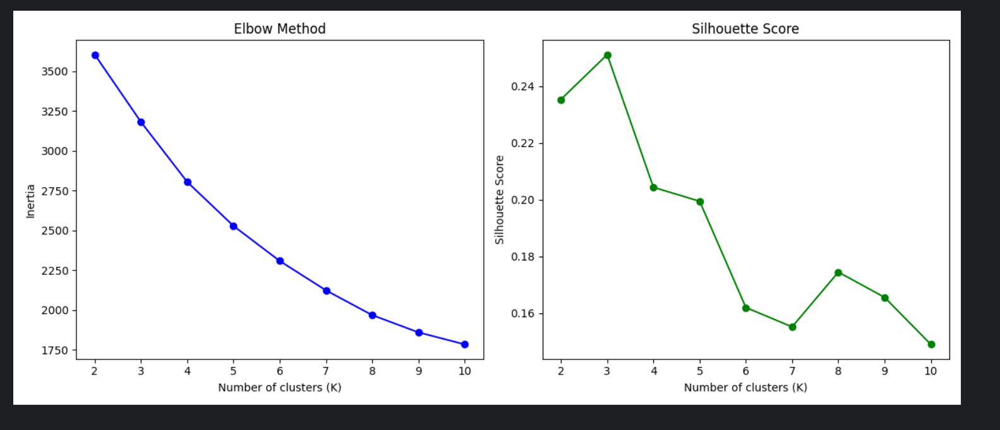
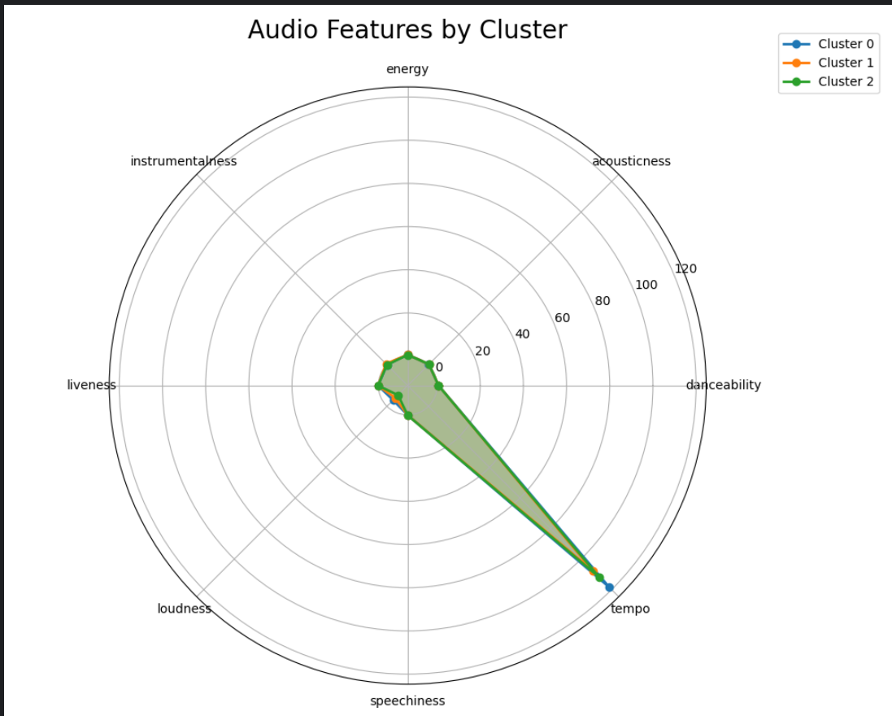

# 选取最佳k值

## 肘部法则（Elbow Method）分析 
-曲线在K=3时出现明显拐点，K=3为最佳。
## 轮廓分数（Silhouette Score）分析
- 最佳K值为3，此时聚类质量最优。
- 轮廓分数变化规律：
- K=2时分数较低（簇间区分度不足）。
- K=3时达到峰值（簇内紧凑、簇间分离明显）。
- K≥4后分数逐渐下降（簇内样本分散或簇间重叠增加）。
- K=10时轮廓分数最低（过分割导致聚类意义丧失）。
# 雷达图

- Cluster 0（蓝色）
音乐类型：电子舞曲（EDM）、流行电音
特征组合：
高 danceability（适合跳舞）
极高 energy（强烈节奏）
高 loudness（高音量混音）
低 acousticness（电子合成器主导）
应用场景：夜店、运动背景音乐
- Cluster 1（橙色）
音乐类型：民谣、 acoustic 现场音乐
特征组合：
高 acousticness（原声乐器）
高 liveness（现场录音特征）
低 energy（舒缓节奏）
低 loudness（自然音量）
应用场景：咖啡馆、Live House 演出
- Cluster 2（绿色）
音乐类型：器乐背景音乐（如钢琴曲、环境音乐）
特征组合：
高 instrumentalness（无 vocals）
中高 energy（非剧烈但持续）
中等 danceability（可配合轻活动）
中等 loudness（平衡听感）
应用场景：工作/学习背景音乐、影视配乐
